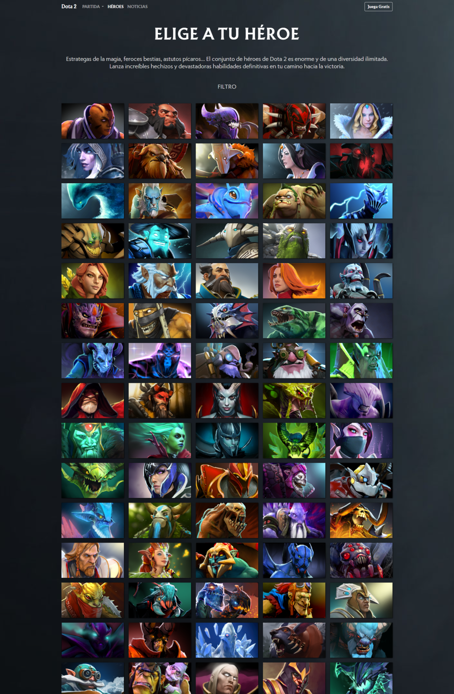

# Ejercicio grid layout css

## Ejercicio para practicar css grid layout

Se consumen servicios para mostrar listado de heroes,
se utiliza el css grid layout para maquetar y hacer el sitio responsive.

#

## Captura del desarroyo actual

